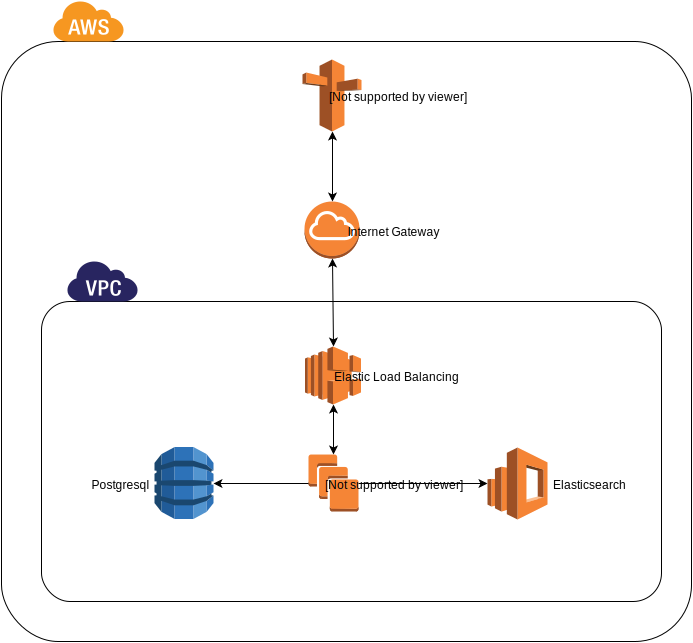

# Backendless Chef Stack

Cloudformation Templates to setup our Chef Stack utilizing AWS RDS and Elastic Search as the Chef Backend

This requires the use of [backendless_chef](https://github.com/HearstAT/cookbook_backendless_chef) cookbook to function.

## Info
* Builds out customized Chef Server build out without any backends to zone lock your setup
* Built to utilize Ubuntu Trusty
* Uses Chef APT Repo for packages (Updated to the new repo)

## What's Setup
* Autoscaled Frontends that utilize AWS resources on backend to act as a Chef Backend.

## Diagram

## Requirements
* Existing VPC
  * IP Scheme of 172.33.0.0/16 or modify template to support whichever
  * SSH Security Group (Will lookup existing groups in AWS, make sure one exists)
* Route53 Hosted Domain/Zone
* Existing SSL Certificate (Loaded into AWS and provide in the params below)

## Parameters
* Instance & Network Configuration
    * InstanceType
    * KeyName
    * SSLCertificateARN (See [here](http://docs.aws.amazon.com/cli/latest/reference/iam/index.html#cli-aws-iam) on how to get the Cert ARN)
      * `aws iam get-server-certificate --server-certificate-name`
    * VPC
    * SSHSecurityGroup
    * AvailabilityZoneA
    * AvailabilityZoneB
    * AvailabilityZoneC
    * HostedZone
* Bucket Configuration
    * UseExistingBucket (True/False, enables using a bucket rather than creating one. Good for re-deploys)
    * ExistingBucket (Bucket Name for the bucket you want to use)
* Re-Deploy Configuration
    * ExistingInstall (True/False, will touch bootstrapped file and pull everything necessary when using an external DB)
* Chef Configuration
    * ChefSubdomain
    * SignupDisable (True/False)
    * SupportEmail (Optional)
    * LicenseCount (Optional, default 25)
    * ChefDir (location for cookbook items)
    * S3DIR (Location to mount created S3 bucket for citadel items and chef backups, i.e.; /opt/chef-s3)
    * BackupEnable (True/False Option, enables a backup script that will run `knife ec` daily and copy to a S3 bucket, keeps only 10 days worth)
    * RestoreFile (optional)
* Mail Configuration (Optional)
    * MailCreds (Setup to noecho throught template)
    * MailHost (Optional)
    * MailPort (Optional)
* New Relic Configuration (Optional)
    * NewRelicEnable (Choose true/false)
    * NewRelicAppName (Name that shows up in New Relic APM)
    * NewRelicLicense (Setup to noecho throught template)
* Sumologic Configuration (Optional)
    * SumologicEnable (Choose true/false)
    * SumologicAccessID (Setup to noecho throught template)
    * SumologicAccessKey (Setup to noecho throught template)
    * SumologicPassword (Setup to noecho throught template)
* External Build Items
    * Cookbook (name of cookbook)
    * CookbookGit (URL for [backendless_chef](https://github.com/HearstAT/cookbook_backendless_chef))
    * CookbookGitBranch (if using something different from master)
    * UserDataScript (URL for the `userdata.sh` script in this repo)
